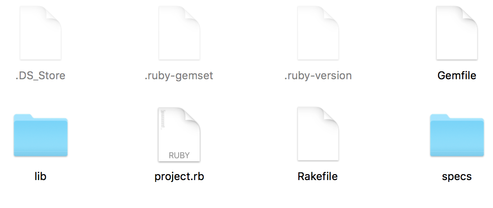
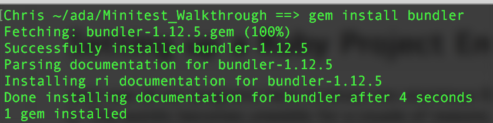
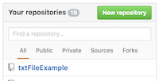
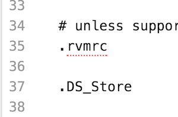

# Test-Driven Development Exploring Minitest


##  Our Objective:

### Today we will learn to

*  Setup a Ruby project environment  
*  Build a specification using [Minitest](http://ruby-doc.org/stdlib-2.0.0/libdoc/minitest/rdoc/MiniTest.html).  
*  Use [Rake](https://github.com/ruby/rake) to execute the tests on the specification or run the project.  


## Setting up a Ruby Project Environment.  

Until now all our programs have involved one enormous file with all of our classes inside it.  This quickly becomes unwieldy for a couple of reasons.  

1.  If the project is broken into separate files team-members can work on the individual files independently.
2.  Git can track changes if each class is broken into individual files.
3.  Later we could potentially reuse classes without importing others if they are broken out into separate files.  

When we are finished your project folder will look something like this:



<!--- ### Making Sure Bundler Is Installed

[Bundler](http://bundler.io/) is a tool to track dependencies in your project making sure the proper gems are available for the project to run.  

To install Bundler:  

`
gem install bundler
`



By default Bundler will install the needed Gems at the system-level.  However you can specify for bundler to install the gems in your project with a command like this:

`
 bundle install --path folder/to/install
`

For now it's enough that we have bundler installed and we can use it to install rake and set up a gemfile.
--->

### Making Sure Rake & Minitest are Installed

Rake is a tool for building applications.  With it you can create different ways to run your application, such as for testing.  You can check to see if Rake is installed with the command:
`
rake.
`

If rake is not found you can install it with: `gem install rake`
You should see:  

```bash
Fetching: rake-11.2.2.gem (100%)
Successfully installed rake-11.2.2
Parsing documentation for rake-11.2.2
Installing ri documentation for rake-11.2.2
Done installing documentation for rake after 0 seconds
1 gem installed
``` 

You can ensure that minitest reporters is installed with `gem install minitest-reporters`
```
Successfully installed minitest-reporters-1.1.11
Parsing documentation for minitest-reporters-1.1.11
Done installing documentation for minitest-reporters after 0 seconds
1 gem installed
```

### Creating a Project

#### Step 1:  Creating a Github Repository

Now that we have Rake installed we can set up our project.  First go to Github and create a new repository named FizzBuzz and then clone the repo to your terminal.



```bash
git clone git@github.com:<USERNAME>/FizzBuzz.git
```

Then change directory into your local repository (cd) and create some configuration files by typing:

```bash
cd PROJECT-NAME
rvm --create --ruby-version ruby-2.3@FIZZ-BUZZ
```  

This will create a pair of files which specify the version of Ruby to use in your project and the project name (Fizz Buzz).  Later we will use Gemfiles to serve this purpose.  

We will also create a [.gitignore](https://github.com/github/gitignore/blob/master/Ruby.gitignore) file which is a file which tells git to ignore certain files & directories.  Copy this file [here](https://github.com/github/gitignore/blob/master/Ruby.gitignore) and save it as .gitignore in your project folder.  Add a line to have it ignore the **.DS_Store** file.




Next lets create a few directories we will use:
```bash
mkdir lib
mkdir specs
```
This creates two folders:
*  lib - The lib folder will hold your classes in your project.
*  specs - The Specs folder will hold your test cases

#### Creating a Rakefile

In the last part of our setup we will create a file called a **Rakefile**.  This file lets you specify tasks you run in your program using Ruby code.  We are just going to create one task in which we will run our testcases.  

So copy the following code into a file named **Rakefile** in the root of your project.

```Ruby
require 'rake/testtask'

Rake::TestTask.new do |t|
  t.libs = ["lib", "specs"]
  t.warning = false
  t.verbose = false
  t.test_files = FileList['specs/*_spec.rb']
  puts "Running TestTask"
end

task default: :test do
	puts "Running my Rakefile"
end
```

The code above creates a TestTask and runs all the files in the specs folder which have filenames that end with _spec.rb and runs that task by default.  The line `task default: :test do` marks test as a prerequisite for the default task, meaning it will run before the default task.

You can run the task with `rake`.  

#### Creating a Module

We will create a Module for our project named FizzBuzz, so create a file named FizzBuzz.rb in the root director with the following code.
```Ruby
module FizzBuzz
end
```

We now have a project environment set up and ready to go!

## Building A Specification

### Problem Description

In this example we will build a FizzBuzz Project which is a method which solves the following problem.

*"Write a method that returns the numbers from 1 to 100. But for multiples of three return “Fizz” instead of the number and for the multiples of five return “Buzz”. For numbers which are multiples of both three and five return “FizzBuzz”.  Everything is returned as a String"*


### Building Test Cases

Because we are follow Test-Driven Development we will need to determine test cases for this problem.  We will do this using Minitest, specifically Minitest's Specification format.

We have built tests like the following:

```Ruby
class YearTest < Minitest::Test
  def test_leap_year
    assert leap_year?(1996), 'Yes, 1996 is a leap year'
  end

  def test_non_leap_year
    skip
    refute leap_year?(1997), 'No, 1997 is not a leap year'
  end
end
```

This works fairly well, but Minitest has another format which does the same thing, is more readable for non-Ruby programmers and it's in a similar format to other testing frameworks like **RSpec**.

The new format is called spec-style testing.  

```Ruby
require 'minitest'
require 'minitest/spec'
require 'minitest/autorun'
require 'minitest/reporters'


require_relative 'leap_year'

describe "Testing Leap Year" do
  it "Testing Leap Year on regular years divisible by 4" do
      leap_year(1996).must_equal(true)
  end
end
```

The **describe** line simply describes the types of tests you are running. You can either give it a String or a class name. We use it to group together tests over as a test case.  

The line starting with **it** simply defines a test with a descriptive String passed as a parameter, think of it like a method definition.  

Minitest Specs add a bunch of methods like in the chart below letting you write more readable tests. They are analogous to the assert methods we used in our previous automated testing.  

#### Minitest Spec Expectation Methods

|   Expectation	|   Opposite	|   Example  	|
|-----------	|-----------	|-----------	|-----------	|---	|
|  must\_be 	|   wont\_be	|   expect(@balance).must_be :balance?
|  must\_be\_empty 	|   wont\_be\_empty	|   expect(@owners.must\_be\_empty)
|  must\_be\_instance\_of 	|   wont\_be\_instance\_of	|   expect(@owner).must\_be\_instance\_of Owner
|  must\_be\_nil 	|   wont\_be\_nil	|   expect(@owner).must\_be\_nil
|  must\_equal 	|   wont\_equal	|   expect(@balance).must\_equal 1000
|  must\_include 	|   wont\_include	|   expect(@names).must\_include 'Ada Lovelace'
|  must\_match 	|   wont\_match	|   expect(@names.first).must\_match 'Ada Lovelace'
|  must\_raise 	|   				|   expect( proc { Account.new() }.must\_raise ArgumentException


#### Creating Specs for FizzBuzz

So for Fizzbuz we will need to test for:

1.  Cases where the number is not divisible by 3 or 5.
2.  Cases where the number is divisible by 3 and not 5
3.  Cases where the number is divisible by 5 and not 3
4.  Cases where the number is divisible by both 3 & 5.

We can build the first two test cases like this:

```Ruby
# fizzbuzz_spec.rb
require 'minitest'
require 'minitest/spec'
require 'minitest/autorun'
require 'minitest/reporters'


require_relative '../lib/fizzbuzz'

describe "Testing FizzBuzz" do
  it "Testing for cases not divisible by 3 or 5" do
      expect(FizzBuzz::Fizzbuzz.fizzbuzz(1)).must_equal("1")
      expect(FizzBuzz::Fizzbuzz.fizzbuzz(2)).must_equal("2")
      expect(FizzBuzz::Fizzbuzz.fizzbuzz(4)).must_equal("4")
  end
  it "Testing for cases divisible by 3 and not 5" do
      expect(FizzBuzz::Fizzbuzz.fizzbuzz(3)).must_equal("Fizz")
      expect(FizzBuzz::Fizzbuzz.fizzbuzz(6)).must_equal("Fizz")
      expect(FizzBuzz::Fizzbuzz.fizzbuzz(9)).must_equal("Fizz")
  end
end
```

Now lets setup our fizzbuzz method.  Lets create a lib/fizzbuzz.rb file
```Ruby
# Fizzbuzz.rb

class FizzBuzz::Fizzbuzz
  def self.fizzbuzz(number)
    return number.to_s
  end
end
```

Now when we run the test cases with `rake` we will get:
```bash
(in ~/FizzBuzz)
Running TestTask
Run options: --seed 39072

# Running:

.F

Finished in 0.001504s, 1329.4027 runs/s, 2658.8055 assertions/s.

  1) Failure:
Testing FizzBuzz#test_0002_Testing for cases divisible by 3 and not 5 [~/FizzBuzz/specs/fizzbuzz_spec.rb:16]:
Expected: "Fizz"
  Actual: "3"

2 runs, 4 assertions, 1 failures, 0 errors, 0 skips
rake aborted!
Command failed with status (1): [ruby -I"lib:specs" -I"~/.rvm/gems/ruby-2.3.0@global/gems/rake-10.4.2/lib" "~/.rvm/gems/ruby-2.3.0@global/gems/rake-10.4.2/lib/rake/rake_test_loader.rb" "specs/fizzbuzz_spec.rb" ]

Tasks: TOP => default => test
(See full trace by running task with --trace)
```

So we need to fix the fizzbuzz method to that it satisfies the test cases.
```Ruby
# Fizzbuzz.rb
require_relative '../Fizzbuzz.rb'

class FizzBuzz::Fizzbuzz
  def self.fizzbuzz(number)
    if number % 3 != 0 && number % 5 != 0
      return number.to_s
    elsif number % 3 == 0 && number % 5 != 0
      return "Fizz"
    else
      return "Buzz"
    end
  end
end

```

Now it passes the tests, but we still have more tests to write.  

### Exercise 1:  Finish The Test Cases

Now write the further two test cases and edit the *fizzbuzz* method to solve the proposed problem.


### Exercise 2:  Refactoring

Notice that our solution is not terrifically efficient (technical term).  It potentially compares the number to 3 & 5 multiple times, so there is a more efficient method.  Attempt to improve on the solution, and then re-run the tests to make sure it still satisfies the specs.  

